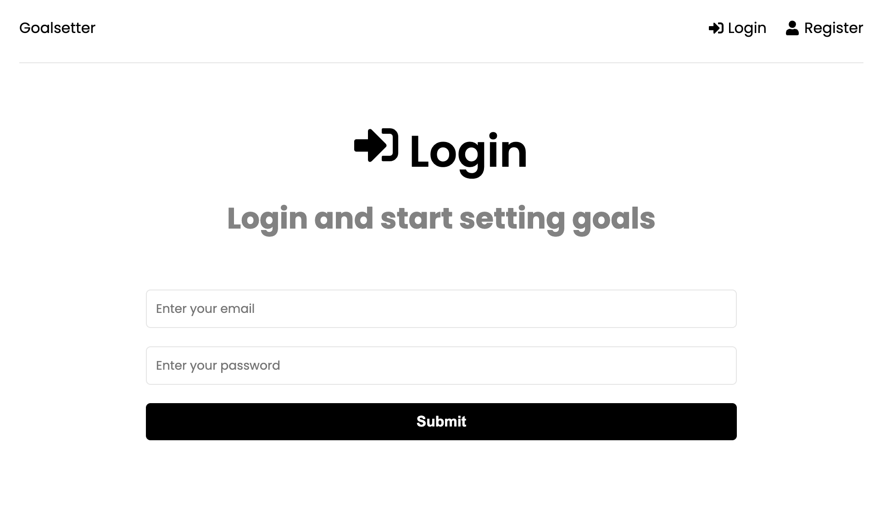
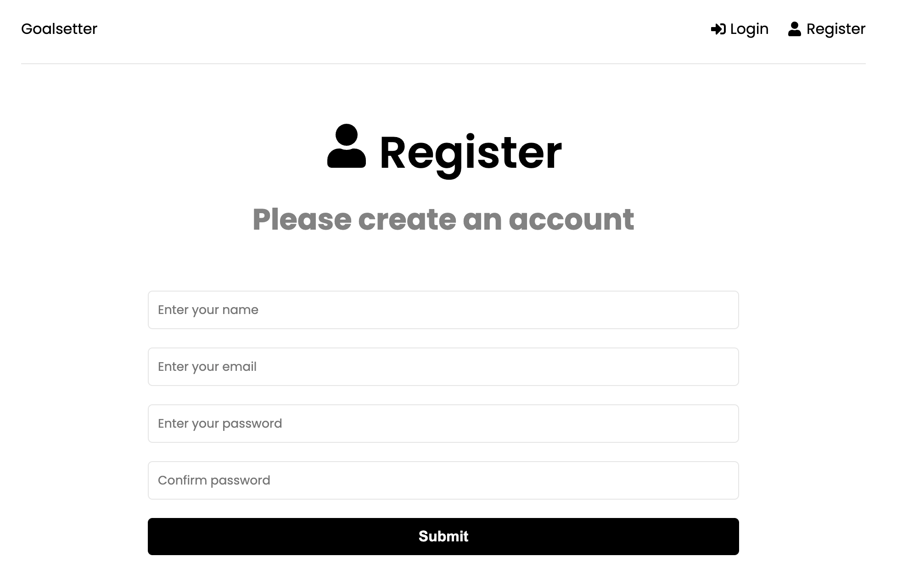
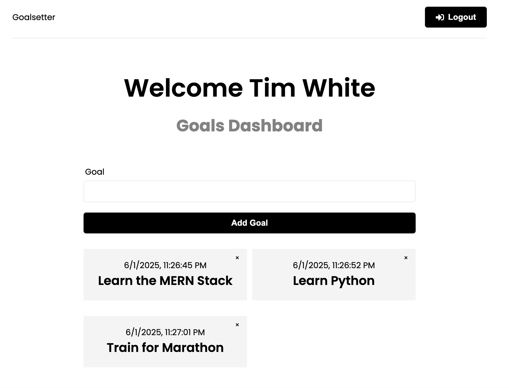

# Goalsetter App

The Goalsetter App is a full stack application built using the MERN stack (MongoDB, Express.js, React, Node.js). It allows users to create, manage, and track their goals. The app features user authentication, goal management, and a responsive user interface.

## Live App URL

https://mern-goals-five.vercel.app/

## Screenshots

### Login



### Register



### Dashboard



## Features

- **User Authentication**: Secure user registration, login, and logout functionality.
- **Goal Management**: Users can create, update, and delete their goals.
- **State Management**: Redux Toolkit is used for managing global state.

## Technologies Used

### Frontend

- **React** for building the user interface.
- **Redux Toolkit** for state management.
- **React Router** for navigation and routing.
- **Axios** for making HTTP requests to the backend.
- **CSS** for styling the application.

### Backend

- **Node.js** for building the server-side logic.
- **Express.js** for handling API routes and middleware.
- **MongoDB** for storing user and goal data.
- **Mongoose** for interacting with the MongoDB database.

## Project Structure

### Backend

- **/routes**: Contains API routes for users and goals.
- **/middleware**: Custom middleware for error handling and authentication.
- **/config**: Database connection configuration.
- **server.js**: Entry point for the backend server.

### Frontend

- **/src/pages**: Contains React pages like `Dashboard` and `Login`.
- **/src/components**: Reusable components like `GoalForm`, `GoalItem`, and `Spinner`.
- **/src/features**: Redux slices for managing state (for example, `authSlice`, `goalSlice` ).

## Installation

### Prerequisites

- **Node.js**: Ensure Node.js is installed on your system.
- **MongoDB**: Set up a MongoDB database (local or cloud, for example, MongoDB Atlas).

### Steps

1. Clone the repository.

```
git clone https://github.com/philipstubbs13/mern-goals.git
cd mern-goals
```

2. Install backend dependencies.

```
npm install
```

3. Navigate to the frontend directory and install dependencies.

```
cd frontend
npm install
```

4. Create a `.env` in the root directory and add the following:

```
MONGO_URI=your-mongodb-connection-string
JWT_SECRET=your-jwt-secret
NODE_ENV=development
PORT=5001
```

5. Run the server and client together in development.

```
npm run dev
```

6. Open your browser and navigate to `http://localhost:5173`.

7. Register a new user or log in with an existing account.

8. Create, update, or delete goals from the dashboard.

## API Endpoints

### User Routes

- POST `/api/users/register`: Register a new user.
- POST `/api/users/login`: Log in a user.
- GET `/api/users/me`: Get the logged-in user's details.

### Goal Routes

- GET `/api/goals`: Get all goals for the logged-in user.
- POST `/api/goals`: Create a new goal.
- PUT `/api/goals/:id`: Update a goal.
- DELETE `/api/goals/:id`: Delete a goal.

## Key Features in Code

### Backend

- **Authentication Middleware**: Protects routes by verifying JWT tokens.
- **Goal Routes**: Handles CRUD operations for goals.

### Frontend

- **Dashboard Page**: Displays user-specific goals and allows goal management.
- **Redux Slice**: Manages state for goals.

## Deployment

### Deploying to Vercel

1. Navigate to the `frontend` directory in your terminal.

2. Run the following command to create a production build.

```
npm run build
```

This will generate a `dist/` folder with static files, which will be served by the Node.js server.

3. The `vercel.json` file is already created and available in the project root folder. This file configures the Vercel deployment.

4. Install the Vercel CLI (if not already installed).

```
npm install -g vercel
```

5. Log in to Vercel.

```
vercel login
```

6. Deploy the project to production.

```
vercel --prod
```

7. Confirm deployment. After a few moments, Vercel will provide a link to your deployed application.

Once deployed, you should be able to access both the frontend and the backend API.

For more information on deploying a MERN stack app to Vercel, see the following [article](https://medium.com/@avinashukla0704/how-to-deploy-a-combined-react-and-node-js-app-on-vercel-2cb75574cad9).

## Future Enhancements

- Add user profile management.
- Implement notifications for goal deadlines.
- Add analytics for tracking goal progress.
- Integrate with third-party APIs for additional features.
